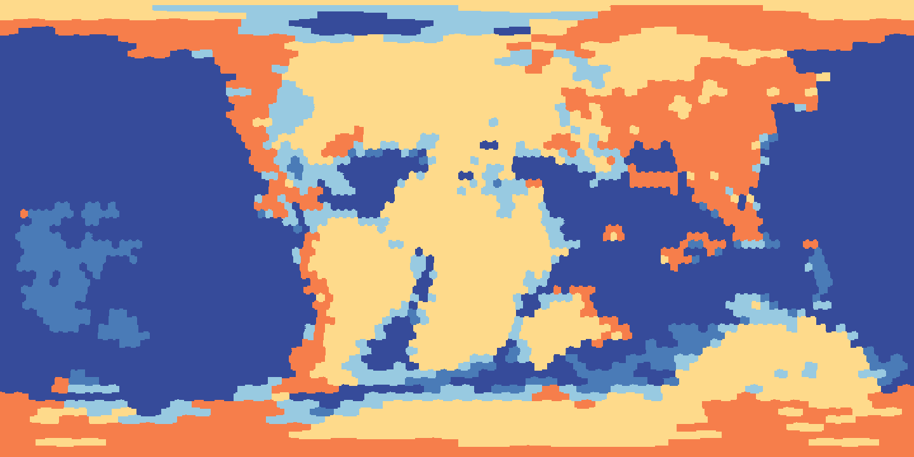

To understand the ancient geography of the world,
geologists build *paleogeographic models*.
These models are quite useful in biogeography,
as they help to provide an explicit spatial dimension
to help us understand the evolution
of the geographic ranges along deep geological time.
In this practice,
we will give an introduction
to these paleogeographic models
adapted for phylogenetic biogeography using `PhyGeo`.

## Requirements

### Software

For this practice,
we will use the program `plates`
(available at:
<https://github.com/js-arias/earth>)
that must be running on the command line.

### Data

For this laboratory,
we will use the paleogeographic model of Müller et al.
(2022 *Solid Earth* **13**:1127),
with the paleogeography of Cao et al.
(2017 *Biogeosci.* **14**:5425)
which is available at:
<https://github.com/js-arias/gm-muller-2022>.
For other available models,
you can go to the GitHub repository at:
<https://github.com/js-arias/geomodels>.

The model is provided in three different resolutions
(120, 180, and 360 degrees at the equator).
Usually we want to use the models with the highest resolution,
but for time reasons,
in these practices we will use the model
with the lowest resolution of e120.
It must be noted that this model has more resolution
than traditional predefined area models.

## Plate motion model

### Plate motion model file

A *plate motion model* describes the location of pixels
at different time stages.
If you open the file `muller-motion-120-5.tab`,
you will see something like this:

```csv
# plate motion model
# data save on: 2023-06-23T14:54:05-03:00
equator plate   pixel   age     stage-pixel
120     101     1       0       1
120     101     1       5000000 1
120     101     1       10000000        1
120     101     1       15000000        1
120     101     1       20000000        1
120     101     1       25000000        0
120     101     1       25000000        2
120     101     1       30000000        0
...
```

The column `equator` indicates the resolution of the pixelation
(in this case, 120).
The column `plate` indicates the ID of a tectonic plate,
the column `pixel` indicates the ID of a pixel
in the current pixelation at present time,
the column `age` indicates the age of the stage
in years before present,
and the column `stage-pixel` indicates the location
of the pixel in that stage.

### Pixel IDs

Most of the time,
you will use the plate motion model file
(or a similar file that uses pixel IDs
from the equal area pixelation
used by `plates` and `PhyGeo`)
in a program that understands it,
but maybe you want to process the file by yourself
for some reason
(for example,
making your own figures).
For such cases,
it might be useful to know
that you are transforming pixel IDs
to correct geographic locations.

The file `pixel-ids-120.tab` contains that kind of information.
Here is a part of this file:

```csv
pixel   lat     lon
0       90.000000       -180.000000
1       87.000000       -150.000000
2       87.000000       -90.000000
3       87.000000       -30.000000
4       87.000000       30.000000
5       87.000000       90.000000
...
```

The column `pixel` indicates the pixel ID,
and the columns `lat` and `lon`
indicate the geographic coordinates for the pixel center.

### `plates` command

To deal with paleogeographic models,
we use the program `plates`.
This program has a set of commands
that have different purposes.
By typing just the name of the program,
it will print the list of available commands:

```bash
% plates
A tool to manipulate paleogeographic reconstruction models

Usage:

    plates <command> [<argument>...]

The commands are:

    map              draw a map from a plate motion model
    pixels           commands for pixelated plates files
...
```

If you need help with a command,
you can use the command `plates help`
and the command that you want to know:

```bash
% plates help rotate
Rotate pixels of a plate motion model

Usage:

    plates rotate [--from <age>] [--to <age>] [--step <age>]
        --pix <pix-file> --rot <rotation-file>
        <model-file> [<age>...]

Command rotate reads a rotation file and updates the pixel locations from a
pixelated plate file, and write them into a plate motion model.
...
```

If you type a command with the flag `-h` or `--help`,
it will give you a small overview
of all available flags for the command:

```bash
% plates rotate --help
usage: plates rotate [--from <age>] [--to <age>] [--step <age>]
        --pix <pix-file> --rot <rotation-file>
        <model-file> [<age>...]
```

### Plate motion model time stages

To know the time stages
defined for a plate motion model,
we can use the command `plates stages`:

```bash
% plates stages muller-motion-120-5.tab 
0.000000
5.000000
10.000000
15.000000
20.000000
...
```

The time stages are listed
by their age in millions of years.

### Map plates at different time stages

To make one or more maps of the plates
at different time stages,
we use the command `plates map`:

```bash
% plates map -c 1440 -o m muller-motion-120-5.tab
```

The flag `-c` or `--columns`
is used to indicate the size of the image
(the number of rows is always half
of the number of columns).
The flag `-o` or `--output`
defines the prefix for the output files.
By default,
image maps all time stages will be produced,
but using the flag `--at` with a time
(in million years),
it will only output the requested time stage.
The image maps will be suffixed by their age
in millions of years.


## Paleolandscape models

### Paleolandscape model file

A *paleolandscape model* describes the landscape of pixels
at different time stages.
If you open the file `muller-landscape-cao-paleomap-120-5.tab`
you will see something like this:

```csv
# time pixelation values
# data save on: 2023-06-29T15:22:21-03:00
equator age     stage-pixel     value
120     0       0       1
120     0       1       1
120     0       2       1
120     0       6       2
120     0       7       1
120     0       8       1
120     0       9       1
120     0       10      1
120     0       11      2
...
```

The column `equator` indicates the resolution of the pixelation.
The column `age` indicates the age of the stage
in years before present,
the column `stage-pixel` indicates the pixel ID
at the time stage,
and the column `value` indicates an ID of the landscape
for the stage pixel at the time stage.

The model description
includes a definition for each landscape value.
The repository contains a key
that defines the values of the landscape,
as well as the color and a description of the landscape.
In this case,
this is found in the file `muller-landscape-cao-paleomap-key.tab`:

```csv
key     color   gray    comment
0       54, 75, 154     255     deep ocean
1       74, 123, 183    235     oceanic plateaus
2       152, 202, 225   225     continental shelf
3       254, 218, 139   195     lowlands
4       246, 126, 75    185     highlands
5       231, 231, 231   245     ice sheets
```

The column `key` is the ID of the landscape value.
The column `color` contains the RGB[^RGB] description
used for output for each value;
the colors are separated by commas.
The column `gray`  contains the color value for a grayscale.
The column `comment` contains a verbal description
of the landscape.
This column is not required by programs
that use the key file for output.

[^RGB]: <https://en.wikipedia.org/wiki/RGB_color_model>.

### Paleolandscape model time stages

To know the time stages of a paleolandscape model,
we can use the command `plates timepix stages`:

```bash
% plates timepix stages muller-landscape-cao-paleomap-120-5.tab 
0.000000
5.000000
10.000000
15.000000
20.000000
...
```

The time stages are listed
by their age in millions of years.

### Map landscape at different time stages

To make one or more maps of the landscapes
at different time stages,
we use the command `plates timepix map`:

```bash
% plates timepix map -c 1440 --key muller-landscape-cao-paleomap-key.tab
-o pl muller-landscape-cao-paleomap-120-5.tab 
```

The flag `-c` or `--columns` is used to indicate
the size of the image.
The flag `--key` is used to define the color key
for the landscape features
(the file that we described before).
The flag `-o` or `--output` defines the prefix
for the output files.
By default,
image maps of all time stages will be produced,
but using the flag `--at` with a time
(in million years),
it will only output the requested time stage.
The image maps will be suffixed
by their age in millions of years.




