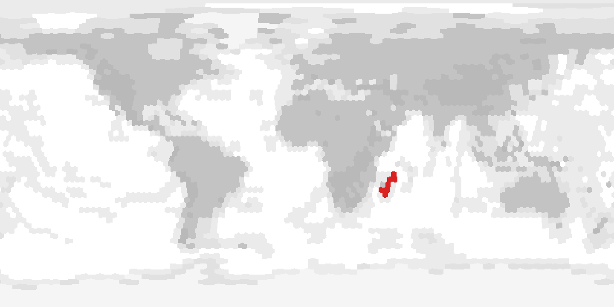
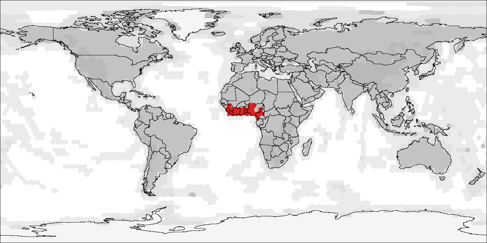

A phylogenetic biogeography analysis
requires several data sources.
`PhyGeo` uses a project file
to simplify the management of these different data sources
in a single file.
In this practice,
we will show how a project can be defined
and how to ensure that everything is right.

## Requirements

### Software

For this practice,
we will use the program `PhyGeo`
(available at:
<https://github.com/js-arias/phygeo>)
that must be running on the command line.

### Data

For this laboratory,
we will use the different data set sources required for a `PhyGeo` project.
For each data set,
the source will be given
at the moment it was used for the first time.

## Geographic data

### `phygeo` program

In this workshop,
we use the program `phygeo` for biogeographic inference.
This program has a set of commands
that have different purposes.
By typing just the name of the program,
it will print the list of available commands:

```bash
% phygeo
A tool for phylogenetic biogeography analysis

Usage:

    phygeo <command> [<argument>...]

The commands are:

    diff             commands for biogeographic inference with diffusion
    geo              commands for paleogeographic reconstruction models
    prj              print information about a project
...
```

If you need help with a command,
you can use the command `phygeo help`
and the command that you want to know:

```bash
% phygeo help range taxa
Print a list of taxa with distribution ranges

Usage:

    phygeo range taxa [--count] [--ranges] [--val] <project-file>

Command taxa reads the geographic ranges from a PhyGeo project and print the
name of the taxa in the standard output.
...
```

If you type a command with the flag `-h` or `--help`,
it will give you a small overview
of all available flags for the command:

```bash
% phygeo range taxa -h
usage: phygeo range taxa [--count] [--ranges] [--val] <project-file>
```

### Plate motion model

Maybe the best way to start a phygeo project
is by adding the plate motion model to the project.
Here, we will add the Müller et al.
(2022 *Solid Earth* **13**:1127)
motion model,
which must be previously located in the working directory
(it can be in any place,
but using it in the working directory
means that it will be easier to share the project
with other researchers):

```bash
% phygeo geo add --type geomotion project.tab muller-motion-120-5.tab
```

The flag `--type` defines the type of model to be added;
in this case,
a plate motion model is defined with the word `geomotion`.
As no project exists,
the new project will be created automatically
with the given name,
in this case `project.tab`.

### Paleolandscape model

The next step is to add a paleolandscape model.
As a plate motion model was defined before,
it is important that the geographic
and temporal scales of the plate motion model
and the landscape model be the same;
otherwise,
the models will not match.
Here we will use the Cao et al.
(2017 *Biogeosci.* **14**:5425)
landscape model with e120 pixelation,
each 5 million years,
which is the same as our plate motion model:

```bash
% phygeo geo add --type landscape project.tab muller-landscape-cao-paleomap-120-5.tab
```

In this case,
we set the `--type` flag to `landscape`.

### Pixel priors

To connect the landscape
with the inference mechanism,
we must define a prior for each kind of landscape.
This prior can be interpreted
as indicating how likely it is that a migrant
will find a suitable environment
in that kind of landscape.
For example,
for a land-dwelling taxon going into a sea pixel,
the prior can indicate
how likely it is to find an island in such a pixel.

Pixel priors are stored in a file delimited by tabs:

```csv
key     prior   comment
0       0.000000        deep ocean
1       0.001000        oceanic plateaus
2       0.005000        continental shelf
3       1.000000        lowlands
4       1.000000        highlands
5       0.001000        ice sheets
```

In this file,
the column `key` contains the key used
in the landscape model
to define a landscape type;
the column `prior` contains the value for the prior
(between 0 and 1),
and the column `comment` is optional
and contains a commentary for the row,
in this case,
the kind of environment associated with the key.

There are two forms to add pixel priors.
They can be added one by one using the flag `--set`
of the command `phygeo geo prior`:

```bash
% phygeo geo prior --set "1=0.001" project.tab
```

If there is no pixel prior file in the project,
it will create a new file;
otherwise,
it will reuse that file
(this is also useful to edit prior values in a pixel file).

In other cases,
you can just add an existing file
with the flag `--add`.
This is useful to re-use prior values
used in a previous project:

```bash
% phygeo geo prior --add model-pix-prior.tab project.tab
```

If you want to see the values currently defined,
use the command `phygeo geo prior` without any flag:

```bash
% phygeo geo prior project.tab                          
1       0.001000
2       0.005000
3       1.000000
4       1.000000
5       0.001000
```

## Phylogenetic trees

### Tree files

The next element in a biogeographic inference
is a time-dated phylogenetic tree.
In a `PhyGeo` project,
it is possible to have multiple trees,
but most of the time we will work with a single tree.
Here we will working with a tree of the plant family Sapindaceae
(Joyce et al. 2023 *Front. Plant Sci.* **14**:1063174).

Trees are stored using a tab-delimited file:

```csv
# time calibrated phylogenetic trees
# data saved on: 2024-04-04T18:39:19-03:00
tree    node    parent  age     taxon
joyce2023       0       -1      104375000       
joyce2023       1       0       79375000        
joyce2023       2       1       38750000        
joyce2023       3       2       31250000        
joyce2023       4       3       0       Hypelate trifoliata
joyce2023       5       3       19375000        
joyce2023       6       5       0       Ganophyllum falcatum
joyce2023       7       5       0       Zanha golungensis
...
```

The `column` tree indicates the name of the tree;
the column `node` is the ID of a node;
the column `parent` indicates the ID of the parent node
(-1 is used for the ancestor of the root node);
the column `age` indicates the age of the node
in years before the present;
and the column `taxon` indicates the name of the taxon.
Terminal nodes must have names,
and parent nodes must be defined before descendant nodes.

### Add a tree

If you already have a tree in the tab-delimited format,
adding a tree can be done
by using the command `phygeo tree add`:

```bash
% phygeo tree add -f data-tree.tab project.tab data-tree.tab 
```

In this case,
as we have no defined a tree file for the project,
we can define it with the flag `-f` or  `--file`,
otherwise it will add the tree
to any other tree in the tree file defined for the project.

Most of the time,
we do not have a tree already as a tab-delimited file.
Instead,
we have the output from some program
in the form of a newick tree;
in this case,
we can add the tree from a newick file:

```bash
% phygeo tree add -newick henophidia project.tab henophidia.tre
```

We must define a name for the tree with the flag `--newick`,
and if the tree does not contain a recent terminal,
we must also use the flag `--age`
to provide the age of the root
(in million years ago).
The newick tree must have branch lengths in million years.
Here,
we use a part of the Squamata tree
(Boas and Pythons)
from a random tree downloaded from VertLife[^VertLife]
(Tonini et al. 2016 *Biol. Conserv.* **204**:23).

[^VertLife]: <https://vertlife.org/data/squamates/>.

### Tree lists

A project can contain one or more trees.
To know the trees currently in the project,
we can use the command `phygeo tree list`:

```bash
% phygeo tree list project.tab 
henophidia
joyce2023
```

We can also list the terminals
that are present in all the trees
using the command `phygeo tree terms`:

```bash
% phygeo tree terms project.tab 
Acer campestre
Acer palmatum
Acer rubrum
Acrantophis dumerili
Acrantophis madagascariensis
Aesculus chinensis
...
```

This will list all the terminals in the project.
With the flag `--tree`,
only the terminals of the indicated will be printed.

### Drawing trees

It is possible to draw the trees in a project
with the command `phygeo tree draw`.
This drawing will be in SVG[^SVG] format
and can be useful to check
that everything is right in the tree
or for publication purposes:

[^SVG]: <https://en.wikipedia.org/wiki/SVG>.

```bash
% phygeo tree draw project.tab 
```

By default,
the name of the tree will be used as the name of the output file
with the `.svg` extension.
You can set an output prefix with the flag `-o` or `--output`
By default,
all trees will be produced;
with the flag `--tree`,
it is possible to define a single tree for output.
The command uses 10 pixels for a million years;
this can be changed
(useful for trees with old branches)
with the flag `--step`.
You can also change the size of the time ticks
with the flag `--tick`,
or add temporal bars with the flag  `--time`.

## Geographic ranges of terminals

### Geographic range data files

The final element for a biogeographic analysis
with `PhyGeo` is the geographic range data
of the terminals.
There are two kinds of geographic ranges used in `PhyGeo`
(currently,
you must choose between them):
one using points
(pixels in which specimen records have been sampled)
or using a continuous range
(such as a range map or a distribution model).

Here we use a dataset on Sapindaceae,
that was processed from a GBIF download
(2023, url:<https://www.gbif.org/occurrence/download/0000527-230828120925497>).

Both kinds of distributions
use the same file format as a tab-delimited file:

```csv
# taxon distribution range models
# data save on : 2024-04-04T18:43:50-03:00
taxon   type    age     equator pixel   density
Acer campestre  points  0       120     254     1.000000
Acer campestre  points  0       120     310     1.000000
Acer campestre  points  0       120     311     1.000000
Acer campestre  points  0       120     372     1.000000
Acer campestre  points  0       120     373     1.000000
Acer campestre  points  0       120     437     1.000000
Acer campestre  points  0       120     438     1.000000
...
```

The column `taxon` is used to define the taxon's name.
This name should match a terminal name on any of the trees;
otherwise,
it will be ignored.
The column `type` defines the type of geographic range;
with `points`,
it defines the range as points,
while with `range`,
it defines it as a pixel in a continuous range.
The column `age` defines the age used for the pixel
in years before the present.
The column `equator` is used to define the resolution
of the pixelation;
the column `pixel` indicates the ID of the pixel,
and the column `density` indicates the density for the pixel;
it should be 1 in points of simple distribution maps
or a number between 0 and 1 in distribution models.

You should not be concerned about the exact values
of the density column;
they will be scaled automatically by the `phygeo` program,
so all the terminals will sum to one.

### Adding records

If you already have the specimen records
in a tab-delimited format,
adding records can be done
by using the command `phygeo range add`:

```bash:
% phygeo range add -f data-points.tab project.tab data-points.tab
```

In this case,
as we do not have a range file for the project,
we can define the range file with the flag `-f` or `--file`.
If no file is defined,
the ranges will be added to the current range files.
By default,
the type of the file is present-absent points.
To be explicit,
you can use the flag `--type` with `points` or `ranges`.
Sometimes,
your file with taxon ranges
can have many more species than the species in the tree;
in such a case,
you can use the flag `--filter`,
and only taxons that are currently defined in a tree
will be added;
otherwise,
all taxons will be added.

Most of the time,
we do not have specimen records in the form of a pixelation,
but more likely we have a list of taxa
and their localities,
or even a raw GBIF [^GBIF] download.
`PhyGeo` can read several forms of files,
so it will be relatively simple to transform
your own database
into a format that PhyGeo can parse.

[^GBIF]: <https://www.gbif.org/occurrence/search?occurrence_status=present&q=>.

format | description
------ | -----------
phygeo | the default phygeo format.
darwin | For example, data downloaded from GBIF. Tab-delimited text with the columns `species`, `decimalLatitude`, and `decimalLongitude`.
pbdb   | Tab-delimited text downloaded from PaleoBiology DB[^PBDB] with columns `accepted_name`, `lat`, and `lon`.
text   | Tab-delimited text with columns `species`, `latitude`, and `longitude`.
csv    | The same as text, but using commas as delimiters.

[^PBDB]: <https://paleobiodb.org/classic/displayDownloadGenerator>.

In this example, we will use a raw GBIF dataset for the serpents
(GBIF 2024, url:<https://www.gbif.org/occurrence/download/0000047-240425142415019>):

```bash
% phygeo range add -type points -format darwin -filter
project.tab 0000047-240425142415019.csv
```

Most of the time,
you don't do something like this;
rather,
you first make a curation of the database
to remove erroneous localities
and set a consistent taxonomy
for your trees and specimen record files.
The flag `--format` provides the format of the file,
and the flag `--filter` ignores records
that cannot be matched with names on the tree.

### List of ranges

We can list the taxa with a defined range
using the command `phygeo range taxa`:

```bash
% phygeo range taxa project.tab      
Acer campestre
Acer palmatum
Acer rubrum
Acrantophis dumerili
Acrantophis madagascariensis
Aesculus chinensis
...
```

By default,
it will list all the taxa with points;
if we want the list of taxa
with defined geographic ranges,
we must use the flag `--ranges`.

### Is everything right?

It is possible that we have an error
either in the names of the tree terminals
or in the names used for geographic ranges.
In such a case,
we want to know which terminals are without geographic range,
as the other case
(a taxon with geographic range but not in a tree)
is harmless.
We can use the command `phygeo range taxa`
with the flag `--val`:

```bash
% phygeo range taxa --val project.tab
INVALID TAXON: no records: Anomochilus leonardi
INVALID TAXON: no records: Brachyophidium rhodogaster
INVALID TAXON: no records: Broghammerus reticulatus
INVALID TAXON: no records: Broghammerus timoriensis
INVALID TAXON: no records: Corallus hortulanus
...
```

If everything is right,
it will end silently.
Otherwise,
it will report the problems found.
These problems should be resolved
before the biogeographic analysis.

A common error is that there is a mismatch
between the names used in the tree
and the name used in the locality data file,
for example,
because of a typo
or because of a different taxonomy.
The preferred course of action
is to solve these errors
and then add the data to the project.
But in some cases,
the errors cannot be solved;
for example,
the tree includes a species described from a unique specimen
with a dubious
or unknown provenance.
For such problems,
maybe the only solution is to remove the taxon
from the phylogeny:

```bash
% phygeo tree remove project.tab 
tree "henophidia": Anomochilus leonardi
tree "henophidia": Brachyophidium rhodogaster
tree "henophidia": Broghammerus reticulatus
tree "henophidia": Broghammerus timoriensis
tree "henophidia": Corallus hortulanus
...
```

### Drawing range maps

It is possible to draw range maps
for each taxon defined in a range file.
This can be useful for checking for errors
but also for including it as supplementary material.
To make maps of taxon ranges,
use the command `phygeo range map`:

```bash
% phygeo range map -c 1440 -key muller-landscape-cao-paleomap-key.tab -gray
-o t project.tab
```

The flag `-c` or `--columns` is used to define
the size of the output image.
The flag `--key` defines a key file
with the color codes used for the landscape;
if the flag `--gray` is used,
the map will be on grayscale
as defined in the key file.
The key file is usually included
with the paleogeographic model.
By default,
the points file will be used for the maps;
use the flag `--ranges` to use continuous range maps.
By default,
the output maps will be called by the taxon name;
with the flag `-o` or `--output`,
a prefix can be added to the name.
For fossil taxa, the range will be shown
in their current time stage,
and with the flag '--unrot',
the range will be rotated to the present geography.
If a single taxon is wanted,
use the flag `--taxon`.
If you have a contour map
(for example,
with all the countries),
you can set them with the flag `--contour`;
the condition is that the contour file
will be of the same resolution as the output image.





## Checking a `PhyGeo` project

Most commands in `PhyGeo` will automatically check
for the files that they need
at the moment that they are executed,
and the file at fault
will be reported on the screen.

If you want to know the files defined in a project,
you can use the command `phygeo prj`:

```bash
% phygeo prj project.tab 
Plate motion model:
        file: muller-motion-120-5.tab
        pixelation: e120
        stages: 121 [0.000-600.000 Ma]

Landscape model:
        file: muller-landscape-cao-paleomap-120-5.tab
        pixelation: e120
        stages: 109 [0.000-540.000 Ma]
...
```

This command will report
all defined files
and some of their characteristics.
