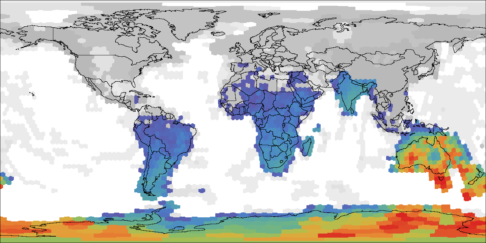
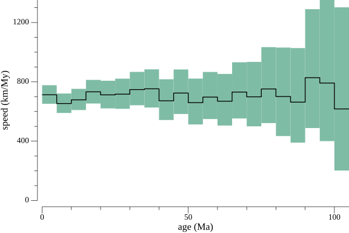
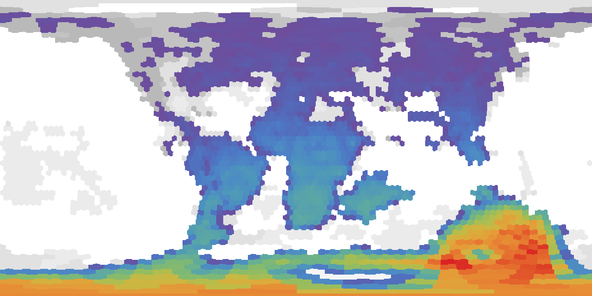

The likelihood of a hypothesis
is the measure of the probability of the observed data
given that hypothesis.
In the case of phylogenetics,
as we do not observe the ancestors of a tree,
we must take into account
all possible histories.
Of course,
some histories will be more probable,
and others will be quite unlikely.
But even if unlikely,
they can give some support
to the phylogenetic hypothesis.
In this practice,
we will calculate the likelihood of the biogeographic data
on some taxa,
given their phylogenetic relationships,
and use a diffusion model
that takes into account the landscape
and the dynamic geography of Earth.

## Requirements

### Software

For this practice,
we will use the program `PhyGeo`
(available at:
<https://github.com/js-arias/phygeo>)
that must be running on the command line.

### Data

For this laboratory,
we will use the data that we prepared previously.
The plate motion model is from Müller et al.
(2022 *Solid Earth* **13**:1127),
and the paleolandscape is from Cao et al.
(2017 *Biogeosci.* **14**:5425).
The phylogeny is the Sapindaceae phylogenomic tree
from Joyce et al.
(2023 *Front. Plant Sci.* **14**:1063174),
and the distribution data was downloaded from GBIF
(2023, url:<https://www.gbif.org/occurrence/download/0000527-230828120925497>).

We will use the e120 resolution
to reduce the running time,
but most of the time we will prefer an analysis
with a higher resolution,
such as the e360 resolution.

## Set-up

### Pixel priors

The Sapindaceae[^Sapindaceae] is a clade of flowering plants.
These plants are terrestrial,
so we selected a set of priors
that reflect that kind of habitat.
We set the prior for emergent land
(either lowlands or highlands,
coded as 3 and 4 in the landscape model)
at 1.0.
On the continental shelf
(coded as 2),
it is possible to have a few islands,
so the prior is set at 0.005,
whereas on deeper oceanic plateaus
and continental slopes
(coded as 1),
it is more unlikely to find an island,
so the prior is set at 0.001.
The probability of finding a viable nunatak
in a glaciar sheet (coded as 5)
is also low, so we set it at 0.001.

[^Sapindaceae]: <https://en.wikipedia.org/wiki/Sapindaceae>.

To check out the pixel priors,
we use the command `phygeo geo prior`:

```bash
% phygeo geo prior project.tab 
1       0.001000
2       0.005000
3       1.000000
4       1.000000
5       0.001000
```

### The command `phygeo diff`

Most of the commands used for inference
with the diffusion model
are grouped in the command `phygeo diff`:

```bash
% phygeo diff
Commands for biogeographic inference with diffusion

Usage:

    phygeo diff <command> [<argument>...]

The commands are:

    freq             calculate pixel frequencies
    integrate        integrate numerically the likelihood curve
    like             perform a likelihood reconstruction
    map              draw a map reconstruction
...
```

The usage of these commands
is the same as for any `phygeo` command.

## The shape of the likelihood function

Before attempting to use a maximum likelihood algorithm,
we might want to know the general shape
of the likelihood function.
If the shape of the function is a gentle curve,
then it will be possible to use a simple algorithm
to find the maximum;
otherwise,
we would need complex routines to find it out.

The traditional way to find the shape of a function
is by making a graphic of its values.
The simplest form is to use a stepwise approximation
by starting at a given value
and increasing the value of the parameter
in a step-wise fashion until an ending value
is reached.
So you must run the whole procedure
to fully explore the whole function.
A simpler method is to use Monte Carlo sampling
by selecting random values of the parameter value
between the starting and ending points.
While both procedures will converge on the same solution,
in Monte Carlo sampling,
you can define a large number of samples
and just stop the running after several samples.

To make Monte Carlo sampling in `PhyGeo`,
we use the command `phygeo diff integrate`
with the flag `--mc` and the number of expected samples:

```bash
% phygeo diff integrate -max 1000 -mc 1000 project.tab 
tree    lambda  stdDev  logLike
joyce2023   994.229507  274.868819  -5665.022108
joyce2023   921.509276  285.126907  -5323.488055
joyce2023   641.440926  342.637797  -4006.573250
joyce2023   203.720138  624.110763  -1918.111478
joyce2023   212.341755  611.114523  -1959.079689
joyce2023   802.860221  305.181313  -4765.446149
...
```

The flags `--min` and `--max` can be used
to define the starting and ending points.
If the flag `--parts` is used
instead of `--mc`,
then a traditional integration will be performed.

To increase the influence of the pixel priors at the root,
a stem root branch is usually added,
by default with 10% of the age of the root node.
To change the length of this branch,
use the flag `--stem` in million years.

The commands used for likelihood calculation
can be very hungry for computational resources,
so by default,
they will use all the available CPUs on the computer.
To change this value,
you can use the flag `--cpu`
(of course,
the analysis will be slower).

The output of the command is a tab-delimited table,
with the `tree` column for the name of the tree,
the `lambda` column for the $\lambda$ value,
the `stdDev` column for the standard deviation,
and the `logLike` column for the log likelihood.


By plotting the first 30 values produced by the command, it seems that the maximum likelihood should be in the interval between 0 and 200. So we run the command again with that new information:

```bash
% phygeo diff integrate -max 200 -mc 1000 project.tab
tree    lambda  stdDev  logLike
joyce2023   9.300172    2896.891222 -1134.964018
joyce2023   128.719480  786.595678  -1558.250261
joyce2023   59.160636   1160.718454 -1229.599770
joyce2023   124.968618  798.351167  -1540.096691
joyce2023   87.220005   955.906474  -1357.791010
joyce2023   143.385535  745.115166  -1629.098874
...
```


It seems that between 20 and 40,
the curve reaches its maximum and then goes down.
As our window seems to be smaller,
we will use a stepwise integration for the final step:

```bash
% phygeo diff integrate -max 60 -parts 30 project.tab
tree    lambda  stdDev  logLike
joyce2023   1.000000    7506.249300 -1126.312552
joyce2023   3.000000    4909.071596 -1140.956961
joyce2023   5.000000    3891.574071 -1145.667321
joyce2023   7.000000    3320.380858 -1142.417851
joyce2023   9.000000    2943.165823 -1136.023178
joyce2023   11.000000   2670.395286 -1129.067754
...
```


The function seems to be quite smooth,
with a maximum between 20 and 40.
There is a local maximum near zero.
At this part of the parameter space,
the distribution is basically uniform,
implying no information in the geographic data
(the dispersal is too fast).
Nevertheless,
I was unable to find a better likelihood
in this part of the parameter space,
up to $\lambda$ values smaller than 0.000001.
It seems that,
starting with a large $\lambda$ value,
a simple hill-climbing algorithm
is quite safe to find the maximum for this dataset.

## Hill-climbing

While making a numerical integration
can show us the shape of the function
as well as the maximum value,
it seems to be a tiresome way to reach the optimal value,
as you need to make several attempts
and refinements of the exploration window.
Nevertheless,
a similar process can be automated.

The command `phygeo diff ml`
searches for the maximum likelihood
by a simple hill-climbing algorithm.
The `--step` flag defines the size of the initial step
(by default,
100).
At each iteration,
the size of the step is cut in half.
The flag `--stop` specifies the size of the step
to stop the search
(by default,
1).
By default,
the search starts at the same value as the first step;
this value can be changed with the flag `--lambda`.

```bash
% phygeo diff ml project.tab 
tree    lambda  stdDev  logLike step
joyce2023   100.000000  892.676216  -1419.247326    100.000000
joyce2023   200.000000  629.970858  -1900.415050    100.000000
joyce2023   150.000000  728.412634  -1660.980795    50.000000
joyce2023   50.000000   1262.504096 -1191.088286    50.000000
joyce2023   75.000000   1030.885712 -1300.501769    25.000000
joyce2023   25.000000   1782.963286 -1116.012198    25.000000
joyce2023   37.500000   1457.370401 -1145.780062    12.500000
joyce2023   12.500000   2509.029349 -1124.305211    12.500000
joyce2023   31.250000   1595.866953 -1128.263583    6.250000
joyce2023   18.750000   2055.813682 -1112.828391    6.250000
joyce2023   21.875000   1904.950760 -1112.922064    3.125000
joyce2023   15.625000   2249.050274 -1116.574742    3.125000
joyce2023   20.312500   1976.096526 -1112.444391    1.562500
joyce2023   21.093750   1939.550176 -1112.582816    0.781250
joyce2023   19.531250   2014.779037 -1112.521502    0.781250
# joyce2023 20.312500   -1112.444391    <--- best value
```

For this dataset,
the maximum likelihood estimation of $\lambda$ is 20.31 +/- 0.7.

## Making a reconstruction

### Likelihood calculation

The command for a likelihood reconstruction is `phygeo diff like`.
This command has several flags;
the most important is the flag `--lambda`,
which defines the concentration parameter
for the spherical normal in units of
million years/radians^2^.
By default, the command will be run using points;
to change this,
use the flag `--ranges`.
The flag `-o`,
or `--output`,
is used to define the prefix of the output files.

Here we will run the command
with a lambda value of 20.31
(the maximum likelihood value).
When practicing this guide,
try several other values of lambda
and see how the likelihood changes.
We will store the values in files prefixed with `like`:

```bash
% phygeo diff like --lambda 20.31 -o like project.tab 
```

The command `phygeo diff like` stores the results
of each tree in a tab-delimited file.
The file is defined by the prefix of the file,
set by the flags `-o` or `--output`,
the name of the project file,
the tree name,
the lambda value,
and the suffix `-down`.
The output of this run
will be the file `like-project.tab-joyce2023-20.310000-down.tab`.

```csv
# diff.like on tree "joyce2023" of project "project.tab"
# lambda: 20.310000 * 1/radian^2
# standard deviation: 1976.216795 * Km/My
# logLikelihood: -1112.444287
# date: 2024-04-24T10:36:12-05:00
tree    node    age     type    lambda  equator pixel   value
joyce2023       0       114812500       log-like        20.310000       120     0       -1122.23459797
joyce2023       0       114812500       log-like        20.310000       120     1       -1122.25073923
joyce2023       0       114812500       log-like        20.310000       120     2       -1127.53579485
joyce2023       0       114812500       log-like        20.310000       120     3       -1122.21906596
joyce2023       0       114812500       log-like        20.310000       120     4       -1122.21562165
joyce2023       0       114812500       log-like        20.310000       120     5       -1122.22716758
...
```

The header of the file stores some comments about the run,
such as the lambda value used for the run,
its equivalent in the form of the standard deviation,
and the log likelihood;
in this case,
it was -1112.44.

The main results are stored as a tab-delimited table,
in which the column `tree` contains the tree name,
the column `node` the node ID,
and the column `age` the age of the node
in years before the present.
The column type indicates the kind of file;
in this case, `log-like` indicates that it stores
the conditional likelihoods of each pixel
in the form of log likelihood values.
The column `lambda` indicates the lambda value
used for the likelihood calculation.
The column `equator` indicates the resolution of the pixelation,
and the column `pixel` indicates the ID
of the pixel in that pixelation.
The column `value` stores the log-transformed conditional likelihood of the pixel.

The likelihood files
are useful for other analyses
that require the conditional likelihoods of each pixel
at each node,
so it will be a good idea to keep track of these files
for further use.

### Ancestral ranges

To estimate assignations in the ancestors,
we use stochastic mapping
(Yang 1995 *Genetics* **141**:1641;
Nielsen 2002 *Syst. Biol.* **51**:729).
The stochastic mapping is a simulation of particles
that move with diffusion
but are conditioned by the information from the down-pass.

The command to perform stochastic mapping is `phygeo diff particles`:

```bash
% phygeo diff particles -p 10000 -i like-project.tab-joyce2023-20.310000-down.tab
-o p project.tab 
```

With the flag `-p` or `--particles`,
the number of particles is defined.
To get a reasonable approximation,
more than 1000 particles should be simulated.
The flag `-i` or `--input` defines the input file,
that is,
the results from a likelihood calculation.
The flag `-o` or `--output` defines the prefix
of the output file.
The output file name is defined by the output prefix,
the name of the tree,
the lambda value,
and the number of particles.
In this run,
the output will be `p-joyce2023-20.310000x10000.tab`.

```csv
# stochastic mapping on tree "joyce2023" of project "project.tab"
# lambda: 20.310000 * 1/radian^2
# standard deviation: 1976.216795 * Km/My
# logLikelihood: -1112.444287
# up-pass particles: 10000
# date: 2024-04-24T10:45:05-05:00
tree    particle        node    age     equator from    to
joyce2023       0       0       110000000       120     4437    4436
joyce2023       0       0       105000000       120     4476    4581
joyce2023       0       0       104375000       120     4580    4541
joyce2023       0       1       100000000       120     4541    4510
joyce2023       0       1       95000000        120     4538    4138
joyce2023       0       1       90000000        120     4063    4464
...
```

The header of the output file
contains basic information about the run,
including the number of particles.
The output file is a tab-delimited file.
The column `tree` indicates the tree,
the column `particle` the ID of the simulated particle,
the column `node` the ID of the node,
and the column `age` the age of the node
in years before present.
The column `equator` contains the resolution of the pixelation,
and the columns `from` and `to`
define the starting and ending pixels
for that segment of the branch.

### Making a map of the reconstructions

Maybe the most important use of a stochastic map
is to make an image map of the reconstructions
in the nodes.
To do this,
first we need to transform the particle file
into a frequency file using the command `phygeo diff freq`:

```bash
% phygeo diff freq -i p-joyce2023-20.310000x10000.tab -o freq project.tab 
```

The flag `-i` or `--input` defines the input file,
in this case the particle file,
and the flag `-o` or `--output` defines the prefix
of the output file.
The output file will be named by the output prefix,
the name of the project,
and the name of the particle file;
in this case,
the name will be `freq-project.tab-p-joyce2023-20.310000x10000.tab.tab`.

```csv
# diff.freq, project "project.tab"
# date: 2024-04-24T10:47:12-05:00
tree    node    age     type    equator pixel   value
joyce2023       0       110000000       freq    120     0       0.000100000000000
joyce2023       0       110000000       freq    120     6       0.000100000000000
joyce2023       0       110000000       freq    120     9       0.000100000000000
joyce2023       0       110000000       freq    120     11      0.000100000000000
joyce2023       0       110000000       freq    120     17      0.000100000000000
...
```

The structure of this kind of file
is identical to the file used for the conditional likelihoods
(or down-pass)
file,
but in this case, the column `type`
is set to `freq` to indicate that the stored values
are frequencies.

To make the image maps, we use the command `phygeo diff map`:

```bash
% phygeo diff map -c 1440 -key muller-landscape-cao-paleomap-key.tab -gray
-i freq-project.tab-p-joyce2023-20.310000x10000.tab.tab -o "maps/f" project.tab 
```


The flag `-c` or `--columns` indicates the size of the image
in pixels
(the number of rows is columns/2).
The flag `--key` is used to define the color key
for the landscape features,
and the flag `--gray` is used to indicate
that the features should be in gray scale.
The flag `-i` or `--input` is used to indicate the input file,
and the flag `-o` or `--output` sets the prefix
of the output files.
As we want the files to be in the maps directory,
we include the name of the directory in the prefix.
The output maps are defined by its prefix,
the name of the tree,
the ID of the node,
and the age of the node,
for example,
the illustrated node is named `f-joyce2023-n46-100.000.png`.

### Smoothing maps

As stochastic mapping is a sampling procedure,
the results can have some noise
unless you do a lot of samples.
One way to smooth the results
is by using a kernel density estimation[^KDE],
using the command `phygeo diff freq` with the flag `--kde`:

```bash
% phygeo diff freq -kde 1000 -i p-joyce2023-20.310000x10000.tab -o kde project.tab 
```

[^KDE]: <https://en.wikipedia.org/wiki/Kernel_density_estimation>.

The KDE used in `PhyGeo` is based on the spherical normal,
and the bandwidth is just the $\lambda$ parameter
for that function.
As we want a slight smoothing,
we use a large $\lambda$ value.

```csv
# diff.freq, project "project.tab"
# KDE smoothing: lambda 1000.000000 * 1/radian^2
# date: 2024-04-24T11:11:05-05:00
tree    node    age     type    equator pixel   value
joyce2023       0       110000000       kde     120     0       0.009943419308229
joyce2023       0       110000000       kde     120     1       0.003484871868701
joyce2023       0       110000000       kde     120     2       0.003162900017685
joyce2023       0       110000000       kde     120     3       0.001356265192397
joyce2023       0       110000000       kde     120     4       0.000388426085161
...
```

The structure of the output file
is the same as in a frequency file,
but in the column `type`,
the value is set to `kde`.

Now we can make maps in the same fashion as before:

```bash
% phygeo diff map -c 1440 -key muller-landscape-cao-paleomap-key.tab -gray
-i kde-project.tab-p-joyce2023-20.310000x10000.tab.tab -o "maps/k" project.tab
```


By default, the KDE is mapped up to 95%.
To change this value,
you can use the flag `--bound`.

As the geography of the past can be quite different
from present geography,
sometimes it can be convenient
to map results using present geography:

```bash
% phygeo diff map -c 1440 -key muller-landscape-cao-paleomap-key.tab -gray
-i kde-project.tab-p-joyce2023-20.310000x10000.tab.tab --unrot
--contour world_location_map-black_lines-1440.png -o "maps/u" project.tab
```



The additional flags used here are `--unrot`
that is used to rotate the past geographies
to present geography with the plate rotation model
defined in the project.
As a guide,
you can also have a contour map
defined with the flag `--contour`.
A contour map is an image in which black pixels
will be printed in the output;
it should be of the same size as the output image.

## Other analyses

### Speed

With the simulated particles,
it is possible to make an inference about the speed reached
by every lineage in the tree.
As we have a plate motion model,
we know that the values that we are inferring
represent only the biological component of the movement.

The command to retrieve speed and distances is `phygeo diff speed`:

```bash
% phygeo diff speed -tree sp -step 5 -i p-joyce2023-20.310000x10000.tab project.tab 
tree    node    distance    d-025   d-975   brLen   speed
joyce2023   --  3107534.995 2988304.990 3230308.515 4417.94 703.389
joyce2023   1   16003.947   8776.020    26063.117   25.000  640.158
joyce2023   2   27067.890   16496.363   40354.876   40.625  666.287
joyce2023   3   5555.663    1674.820    11259.945   7.500   740.755
...
```

The flag  `--tree` sets a prefix for a tree output file,
in which branches will be colored
by the magnitude of the speed.
With the flag `--step`,
it is possible to change the number of pixels
per million years.
The flag `-i` or `--input` defines the input file.

The output is printed to the screen
in the form of a tab-delimited table,
with the column `tree` for the tree name
and the column `node` for the node ID.
The columns `distance`,
`d-025`,
and `d-975` provide the average distance in kilometers
and the limits of the distribution
at 2.5 and 97.5%.
The columns `brLen` give the branch length
in million years,
and the column `speed` gives the speed
in kilometers per million years.
The first row shows the results for the whole tree.



Another way to look at the speed is by measuring it at each time slice:

```bash
% phygeo diff speed -time -plot ts -i p-joyce2023-20.310000x10000.tab project.tab 
tree    age distance    d-025   d-975   brLen   speed
joyce2023   0   505843.303  462643.850  551496.183  709.627712.830
joyce2023   5000000 427904.875  386304.459  472158.884  654.608653.682
joyce2023   10000000    393208.956  353388.885  436232.490  579.569 678.451
joyce2023   15000000    348779.238  311329.313  387107.120  476.139 732.516
joyce2023   20000000    260869.579  227500.788  295772.855  366.381 712.018
joyce2023   25000000    218228.731  188116.342  249989.294  304.375 716.973
...
```

The flag `--time` defines the analysis to be on time slices.
The flag `--plot` is used to define the output plot
of the speed at each time slice.

The output is printed on screen,
and it is similar to the branch speed output,
but instead of nodes,
the data is shown by time slices,
defined by the column `age`.
The calculation of distance and branch lengths
is done for all the branches that cross the time slice.

### Richness

Another potential analysis
is to explore the richness across time.
Here, the richness is the count of lineages present
at a given time slice.
This can be done by using the command map:



```bash
% phygeo diff map -c 1440 -key muller-landscape-cao-paleomap-key.tab -gray -richness
-i kde-project.tab-p-joyce2023-20.310000x10000.tab.tab -o "maps/r" project.tab
```


The key flag here is `--richness`.
This option can be used with other flags
(for example,
it can be un-rotated
or printed at the present time).
While it can be made using a frequency file,
it is suggested to use smoothed KDE for this kind of approach.
