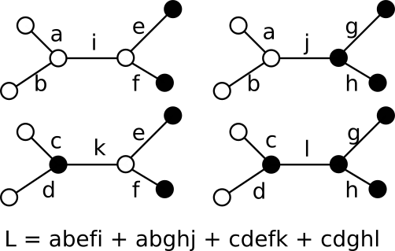
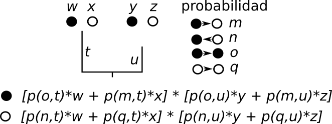

## Biogeography

### Definition of biogeography

Paraphrasing MacArthur
(1972,
*Geographical ecology*):

> The study of the biological phenomena
> that can be put on a map.

### Divisions of biogeography

- Ecological biogeography.
- Historical biogeography:
  *Space, Time, Form* (Croizat, 1962).
  - Phylogenetic biogeography
    (AKA phylogeography,
    taxon history biogeography,
    lineage geohistory).
  - Comparative biogeography
    (AKA Earth history biogeography).

### Phylogenetic biogeography

*Phylogenetic biogeography*
is the study
of the evolutionary history
of a particular clade.

- Dynamic geography model.
- Geographic ranges.
- Time calibrated phylogentic tree.

### From drawing by hand a phylogeny on a map

### ... To using formal quantitative models

## Geography

### Spatial data

*Spatial data*
is the data that we can put on a map.

- Location.
  The spatial component of the datum.
- Attribute(s).
  One or more characteristics of the datum.

### Geographic data models

A *geographic data model*
is a formalization of spatial data
with the aim of using it
with a computational system.

- Vector data model.
- Raster data model.

### Vector data model

In a *vector data model*,
we use points,
lines,
and polygons
to describe the spatial locations.

While it is continuous,
it is more useful to represent discrete objects,
with one or multiple attributes.

### Raster data model

In a *raster data model*
the space is divided into a matrix,
the location is given by the identity of each matrix cell
(for example,
by using rows and columns),
and each cell stores a particular value.

While it is discrete,
it is more useful to represent continuous fields
(functions whose values depend on the spatial location).

Another advantage
is that you can combine several rasters
using *map algebra*.

### Which data model is the best?

Depending on the question being asked,
each model has its own strengths.

For `PhyGeo` I used a raster model
as it is excellent for fields and map algebra.

### Flat Earth models

Most raster and vector implementations
just transform latitude and longitude
into XY coordinates.
That is,
they use a flat Earth.
While this allows the use of simpler
mathematical operations,
these models have several disadvantages:

- Distances and areas have no meaning.
- Distances over poles are greatly exaggerated.
- Results are dependent on the coordinate system.
- Pixel area depends on latitude.

### Spherical pixelation

Instead of using a flat raster,
we use spherical pixelation
(It is called *pixelation*
to distinguish from the traditional
matrix-like raster).

- Divide Earth into latitude rings
  (as in a raster).
- Divide each ring using the same pixel size
  (as a reference,
  we use pixels in the equator),
  so rings at the equator have the largest number of pixels
  and the poles have a single pixel.
- We shift the pixel starting point by a half pixel
  in odd rings.

### Spherical pixelation: advantages

- The same procedure is used for spherical integration.
- The pixels have roughly the same area.
- The number of pixel neighbors is relatively constant
  at different locations.
- Pixel locations are in 3D space,
  so distances are in the correct units.
- Easy to locate pixels.

## Paleogeography

### Dynamic Geography

Because of plate tectonics,
changes in the sea level,
and climatology,
the geography of Earth has changed with time.

Geographic range evolution happens
in this changing geography,
so we must take it into account
(Ree et al. 2005 *Evolution* **59**:2299).

### Dynamic geography model

- Plate motion model.
- Time based paleogeography.

### Plate motion model

The *plate motion models* are used to indicate
the location of a tectonic element
at a given time.

They are also known as *rotation models*,
as they are based on the *Euler rotation theorem*,
which says that any movement over the surface of a sphere
can be represented by a rotation over the sphere.

### Plate motion model in `PhyGeo`

- Pixels are assigned to plates.
- The rotation model is used to move plates
  at particular time stages
  (say,
  every 5 million years).
  This results in a file with the pixel locations
  at different time stages.
- The program makes a dictionary of the pixel locations
  at one time stage
  and their movement to their closer time stages.

### Time based paleogeography

Paleogeographic models are defined
at particular time stages.
Each pixel is assigned to a particular landscape.

These models do not take into account plate motion.
So we can connect different landscape models
with different plate motion models.

### Where can I find dynamic geography models?

- EarthByte group provides several global models
  at different time scopes
  <https://www.earthbyte.org/category/resources/data-models/global-regional-plate-motion-models/>.
- I made a repository
  with different dynamic geography models
  ready to be used in `PhyGeo`
  <https://github.com/js-arias/geomodels>.

## Geographic distribution ranges

### Models for distribution ranges

- Implicit or abstract models:
  Use predefined areas.
  The range is expressed not as a geographic location
  but as a label.
- Explicit models:
  The geographic range is based on a geographic data model,
  then geographic location is an intrinsic part
  of the data.

### Point models

- Vector model:
  points with the geographical coordinates of each specimen.
- Raster model:
  pixels with specimens are set as true;
  other pixels are set as false.

### Range models

- Uniform models
  (traditional distribution maps):
  - Vector model:
    one or more polygons that represent
    the distribution.
  - Raster model:
    a collection of pixels that represent the distribution.
- Densities models
  (for example,
  produced by a niche model):
  - Vector model:
    Use contour lines to define density levels.
  - Raster model:
    The density value is set for each pixel
    in the distribution.

### Geographic ranges in fossils

Fossil locations are provided in current coordinates.
As geography changes with time,
it is quite possible that the coordinates were different
when the organism was alive.

Some databases provide paleo-coordinates
(for example,
PaleobiologyDB),
but these coordinates are based on a particular plate motion model,
which might be different from the coordinates
obtained by the plate motion model
used in your analysis.

So,
the best approach is to rotate the fossil coordinates
using the same plate motion model
usd during the biogeographic analysis.

## Maximum likelihood

### What is maximum likelihood?

If we have multiple hypotheses,
we can select the hypothesis that makes the observed data
more probable.
This method for selecting hypotheses
is known as *maximum likelihood*.

### Coin toses

Here is a simple example.
Suppose that we throw a coin ten times.
We get 7 heads and 3 tails.
Given this data,
what is the probability of heads for this coin
that maximizes the likelihood?

Likelihood function:

$$
like = p(data \mid h) = p(head)^{7}(1-p(head))^{3}
$$

$$
\ln (like) = 7\ln (p(head))+ 3\ln (1-p(head))
$$

### Coin toses: maximum likelihood

p(head) | logLike
------- | -------
0.3     | -9.49
0.4     | -7.94
0.5     | -6.93
0.6     | -6.32
0.7     | -6.10
0.8     | -6.39

The best value is 0.7.

### Maximum likelihood estimation

But how do we know that we have the best value?
We must search among all possibilities to find it out.

### Analytical solutions

We can use calculus
to estimate the derivative of the likelihood expression
and use it to find the maximum.

Several of the classic statistics,
such as the mean,
or estimators,
such as the linear regression,
are in fact analytical expressions of the maximum likelihood.

Unfortunately,
for many likelihood functions,
we do not know an analytical expression.

## Phylogenetic trees

### Time trees

A *phylogenetic tree* is a representation
of the evolutionary history
of a set of taxons.
It shows how they are related.

In a  *time tree*,
or *chronogram*,
the length of the branches represents elapsed time,
and the time of nodes
represents the splitting time
between two lineages.

As in biogeography,
we are dealing with a dynamic Earth
that changes with time;
we need time trees to relate
evolutive and paleogeographic events.

### Evolutionary models

An *evolutionary model* represents
how evolution works.
They are useful to relate the observations
of terminals
with the relationships in the phylogenetic tree.

### Likelihood

The *likelihood* is the probability
of the observed data,
given a hypothesis.

In a phylogenetic tree *T*,
that means the probability of the observations,
*D*,
over all possible histories of a phylogeny,
given an evolutionary model $\theta$.

$$
Pr(D \mid T, \theta)= \sum_{j_{n+1}} \cdots \sum_{j_{root}}\left [\prod_{i=n+1}^{root}f(l_{a_{n}(i)\rightarrow l_{i}} \mid \theta, t_{i}) \right ]\pi(j_{root})
$$

### Probability of all assignations

### Pruning algorithm

Felsenstein
(1981 *J. Mol. Evol.* **17**: 368)
developed the *pruning algorithm*
to calculate the likelihood.

It has the advantage that it reuses
many calculations,
taking into account the topology of the tree.
It is based on a calculation of
the *conditional likelihood* of a character state
in a node:

$$
L_{n(i)}=(\sum_{j}f(i \rightarrow j \mid \theta, t_{r})L_{r(j)})(\sum_{j}f(i \rightarrow j \mid \theta, t_{r})L_{l(j)})
$$

### Pruning algorithm: graphical representation

### Pruning algorithm: special cases

In a terminal,
the conditional likelihood of a state
is 1 if the state is observed
or 0 otherwise.

At the root,
we calculate the full likelihood
as the sum of the conditional likelihoods
of each state multiplied by its prior:

$$
Pr(D \mid T, \theta)=\sum_{j}\pi (j)L_{root(j)}
$$
